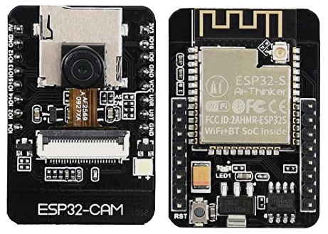
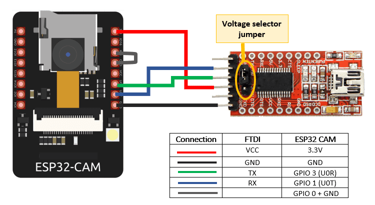

# esp32cam-ready

esp32cam-ready combines multiple projects to have an out-the-box solution to use the Chinese (7 Euro!) esp32cam modules.
Easy installation: Flash, provision using the build in configuration webserver and connect!



Flashing this software in esp32cam will make the esp32cam a **webserver** with **streaming data** from the camera and some more features.
Additionally this software hosts a **RTSP server**, that can be used to connect with standard video applications that use RTSP (for example VLC).
RTSP also allows to stream directly to a server using **ffmpeg**. This makes the module a camera server allowing **recording** and  so the stream can be **stored on a disk** and replayed later.

## Required

- esp32cam module
- USB to Serial (TTL level) converter or the Piggyback board ESP32-CAM-MB

## Wiring
Only during the upload, the esp32cam module needs to be attached using an USB to serial adapter.
This must be wired in the following way:


After programming remove the wire to GPIO0 so the module will start normally.

## Usage
- Download the repo, open it in [**PlatformIO**](https://platformio.org/) and flash it to the esp32cam.
- The device should become available as an access point with the name esp32cam-xxxxxxxxxxxx, where the xxxxxxxxxxxx represents the MAC address of the device.
The default password for the device as access point is '*esp32cam#*'. 
- Connect to the access point and configure the ssid/password in the browser on on the address [http://192.168.4.1](http://192.168.4.1).
- When the credentials are valid and the device connects to the infrastructure, the device can be accessed over http using the link [http://esp32cam.local](http://esp32cam.local) (or the local ip address) from your browser.

RTSP stream is available at: [rtsp://esp32cam.local:554/mjpeg/1](rtsp://esp32cam.local:554/mjpeg/1). This link can be opened with for example [VLC](https://www.videolan.org/vlc/).

Using the browser, you can
- Take a snapshot
- Stream video
- Turn the light on/off
- Remove the Wifi configuration.

## Installing and running PlatformIO

### Debian based systems command-line
Install platformIO
```
 sudo apt-get install python-pip
 sudo pip install platformio
 pio upgrade
```

### Windows / Linux and Mac
Install [**Visual Studio code**](https://code.visualstudio.com) and install the PlatformIO plugin.
For command line usage Python and PlatformIO-Core is sufficient. More information can be found at: [https://docs.platformio.org/en/latest/installation.html](https://docs.platformio.org/en/latest/installation.html)

Clone this repository, go into the folder and type:
```
 pio run
```
Put a jumper between IO0 and GND, press reset and type:
```
 pio run -t upload
```
When done remove the jumper and press reset. To monitor the output, start a terminal using:
```
 pio device monitor
```

## Credits
esp32cam-ready depends on PlatformIO and Micro-RTSP by Kevin Hester.

Thanks for the community making these tools and libraries available.

Also thanks to EspressIf and the guys that created these modules!
